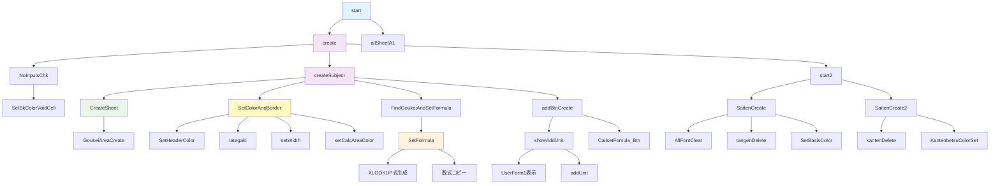

# VBA 採点支援システム

## 概要

学校の評価項目管理および採点基準設定を自動化するVBAシステムです。科目・観点・単元別の評価シートを生成し、自動計算や色分け表示などの機能を提供します。

## 主要機能

### 📚 このアプリでできること

#### 1. 評価シートの自動作成
- **科目別シートの自動生成**: 国語、数学、理科などの科目ごとに、評価入力用のシートを自動で作成
- **生徒名簿の自動配置**: 事前に登録した生徒の名前を各科目シートに自動で配置
- **単元・観点の自動配置**: 設定した単元（例：関数、図形）と観点（知識・技能、思考・判断・表現など）を自動でレイアウト

#### 2. 点数入力と自動計算
- **点数入力**: 各生徒の単元別・観点別の点数を入力
- **合計点の自動計算**: 観点ごとの合計点を自動で計算
- **到達率の自動計算**: 配点に対する達成度を%で自動表示
- **ABC評価の自動判定**: 設定した基準に基づいてA・B・Cの評価を自動判定

#### 3. 入力サポート機能
- **入力忘れチェック**: 未入力の箇所を黄色でハイライト表示
- **データ検証**: 入力漏れや設定ミスを事前にチェック
- **項目追加機能**: 新しい単元を後から簡単に追加可能

#### 4. 見やすい表示
- **色分け表示**: ヘッダーや計算結果を色分けして見やすく表示
- **きれいな罫線**: 表形式で整理された見やすいレイアウト
- **縦書き表示**: 単元名を縦書きで表示し、スペースを効率活用

### 🎯 こんな方におすすめ
- **学校の先生**: 定期テストや評価の集計作業を効率化したい
- **教務担当者**: 複数科目の評価管理を統一的に行いたい
- **学習塾**: 生徒の成績管理と評価基準の統一を図りたい

### ⏰ 作業時間の短縮効果
- **従来**: 科目ごとに手作業でExcelシート作成（1科目30分程度）
- **このアプリ使用後**: 全科目分のシートを一括自動生成（3分程度）
- **年間効果**: 数十時間の作業時間短縮が可能

## システム構成図



## 機能マッピング

### メイン処理フロー
| 機能 | 関数名 | 処理内容 |
|------|--------|----------|
| システム開始 | `start()` | メイン処理とシート初期化 |
| シート作成 | `create()` | 入力チェック→科目シート生成 |
| 科目シート生成 | `createSubject()` | 個別科目シートの詳細作成 |

### データ処理
| 機能 | 関数名 | 処理内容 |
|------|--------|----------|
| 入力チェック | `NoInputsChk()` | 未入力セルの検出と色付け |
| 配列変換 | `Call_RangeTo1DArray()` | Range→1次元配列変換 |
| 重複削除 | `distinct()` | Dictionary使用の重複除去 |
| 配列ソート | `ArraySort()` | 2次元配列の昇順・降順ソート |

### UI・表示制御
| 機能 | 関数名 | 処理内容 |
|------|--------|----------|
| 色・罫線設定 | `SetColorAndBorder()` | 表全体の書式設定 |
| ヘッダー色設定 | `SetHeaderColor()` | ヘッダー部分の色分け |
| 縦書き設定 | `tategaki()` | 単元名の縦書き表示 |
| ボタン生成 | `addBtnCreate()` | 単元追加・数式修正ボタン |

### 自動計算
| 機能 | 関数名 | 処理内容 |
|------|--------|----------|
| 数式設定 | `SetFormula()` | 合計・到達率・評価の数式生成 |
| 合計エリア作成 | `GoukeiAreaCreate()` | 観点合計エリアの作成 |
| 数式修正 | `CallsetFomula()` | 既存数式の再計算・修正 |

### 採点基準管理
| 機能 | 関数名 | 処理内容 |
|------|--------|----------|
| 単元別基準 | `SaitenCreate()` | 単元別採点基準シート作成 |
| 観点別基準 | `SaitenCreate2()` | 観点別採点基準シート作成 |
| 基準色設定 | `SetBasisColor()` | 採点基準シートの書式 |

## ファイル構成

### メインモジュール
- **ArraySort**: 2次元配列のソート機能
- **create**: シート作成のメイン処理
- **createSubject**: 科目別シート生成処理

### データ管理クラス
- **SettingData**: 設定データの一元管理クラス

### ユーティリティ関数
- **SetColorAndBorder**: 色・罫線設定
- **SetFormula**: 自動計算式設定
- **addBtnCreate**: ボタン生成
- **NoInputsChk**: 入力チェック

## 使用方法

アプリケーションの詳細な利用方法については、xlsmファイル内の説明シートを参照してください。

### 基本的な流れ
1. **設定データの入力**: xlsmファイル内の設定シートに必要なデータを入力
2. **メイン処理の実行**: `start()` 関数を実行
3. **結果の確認**: 自動生成されたシートで評価作業を実施

> **📝 詳細情報**: xlsmファイル内の専用説明シートに、画面キャプチャ付きの操作手順が記載されています。

## 技術仕様

### 必要な設定
- **Option Base 1**: 配列の添字を1から開始
- **Microsoft Scripting Runtime**: Dictionary使用のため

### 主要定数
```vba
Public Const SettingSheet As String = "評価項目設定"
Public Const StudentSheet As String = "生徒氏名設定"
Public Const UnitCriteria As String = "採点基準_単元別"
Public Const PointCtriteria As String = "採点基準_観点別"
```

### データ構造
- **2次元配列**: 評価データの管理
- **Dictionary**: 重複削除・検索処理
- **Range**: セル範囲の動的管理

## 注意事項

1. **Option Base 1必須**: ArraySort関数使用時
2. **フィルタ状態管理**: 処理前後でのフィルタ解除が必要
3. **メモリ管理**: 大量データ処理時のオブジェクト解放
4. **エラーハンドリング**: On Error Resume Nextでの例外処理

## カスタマイズ

### 新しい観点の追加
1. `SettingData`クラスの`PointKeys`配列を更新
2. `GoukeiAreaCreate`関数の項目数調整
3. `SetFormula`関数の計算式更新

### レイアウト変更
- `SetColorAndBorder`関数で色・罫線をカスタマイズ
- `setWidth`関数で列幅を調整
- `HeaderStartCell`定数で開始位置を変更

## トラブルシューティング

### よくある問題
1. **配列エラー**: Option Base 1の設定確認
2. **計算式エラー**: 採点基準シートの存在確認
3. **フィルタエラー**: 事前のフィルタ解除
4. **メモリエラー**: オブジェクトの適切な解放

このシステムにより、学校での評価業務を大幅に効率化できます。
